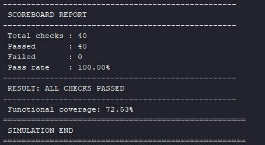
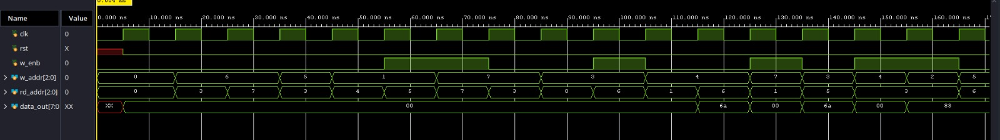
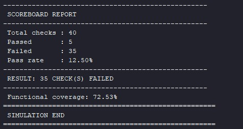
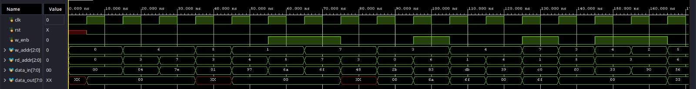
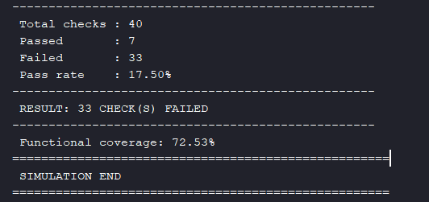
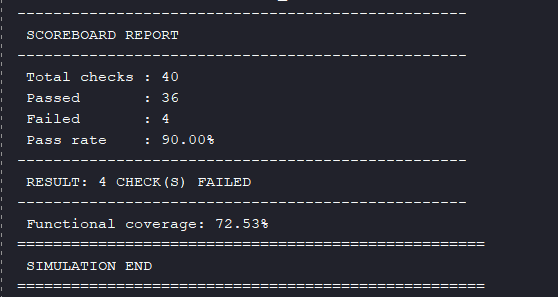

# RAM Verification Environment (SystemVerilog Class-Based Testbench)

This project implements a class-based, constrained-random verification environment for a synchronous single-port RAM, following a structure that mirrors the core building blocks of UVM (generator, driver, monitor, scoreboard, reference model, functional coverage) without using the UVM library itself.

## Design Under Test (DUT)

A synchronous RAM with:

- 8 locations (3-bit address), 8-bit data width
- Synchronous read with 1 clock cycle of latency
- Synchronous write, gated by `w_enb`
- Active-high reset, synchronous to `clk`

```verilog
module ram_design(input clk, rst, w_enb,
                    input [2:0] w_addr,
                    input [2:0] rd_addr,
                    input [7:0] data_in,
                    output reg [7:0] data_out);
```

This RAM design was originally developed as part of a separate project. For more detailed information about the design itself (architecture, design decisions, standalone testing), see the RAM section in the [RAM_FIFO_Project](https://github.com/Daniel-eleng/RAM_FIFO_Project) repository.

## Verification architecture

The testbench follows a classic layered architecture, connected through SystemVerilog mailboxes and a virtual interface with two clocking blocks (`drv_cb` for the driver, `mon_cb` for the monitor).

Data flow, at a glance:

`Generator → Driver → DUT (RAM) → Monitor → { Scoreboard, Reference Model, Coverage }`, with the Reference Model also feeding its prediction into the Scoreboard for comparison.

- **Generator** – produces constrained-random `RAM_transaction` objects (read/write, address, data, with a weighted distribution on `data_in`: 20% min, 20% max, 60% mid-range).
- **Driver** – drives transactions into the DUT through `drv_cb`, one transaction per clock cycle.
- **Monitor** – passively samples the interface through `mon_cb`, reconstructs completed read transactions (accounting for the RAM's 1-cycle read latency), and forwards them to the scoreboard, reference model, and coverage collector.
- **Reference model** – a behavioral "golden" model of the RAM (a simple associative/array-based memory), used to predict the expected `data_out` for every read.
- **Scoreboard** – compares the DUT's actual output against the reference model's prediction and reports PASS/FAIL per read, plus a final summary.
- **Coverage** – collects functional coverage on read address, write address, data value ranges, and their cross product.

Environment size: 80 transactions per run (adjustable in `top_module`), seed-controllable via XSim's `-sv_seed` option (fixed by default, for reproducible debugging; random for regression runs).

## A real bug found during development: reset-boundary sampling glitch

While bringing up this environment, the scoreboard reported a false failure on the very first read of every simulation run (`rd_addr=X`, reference model returning `X`, DUT returning `0`), even though the design itself was correct.

**Root cause:** the monitor's clocking block (`mon_cb`) uses `#1step` input sampling, which captures signal values _just before_ the current clock edge. On the very first real cycle after reset, the driver had not yet propagated its first non-blocking write to `rd_addr` at the moment the monitor's `#1step` sample was taken — so the monitor observed `rd_addr = X`. This value was stored unconditionally and later used to build a read transaction, which the reference model resolved as `RAM[X] = X` (an out-of-range/unknown index), while the DUT's registered output simply held its reset value (`0`). The scoreboard then compared two genuinely different values (`0` vs `X`) and (correctly) flagged a mismatch — the mismatch was real, but the root cause was a testbench sampling artifact, not a DUT bug.

**Fix:** guard the monitor's read-address capture with `$isunknown()`, so that an ambiguous first-cycle sample is discarded instead of being propagated:

```systemverilog
else begin
  if (!$isunknown(inf.mon_cb.rd_addr)) begin
    pending_rd = 1;
    pending_rd_addr = inf.mon_cb.rd_addr;
  end
end
```

This is a good general lesson for clocking-block-based testbenches: never trust a value sampled in the first cycle(s) after reset without an explicit unknown-value guard, even if the underlying signal has a reset/default value.

## Testbench validation via mutation testing (bug injection)

To confirm the testbench actually detects functional bugs — and isn't just passing by construction — three deliberate design faults were injected on separate branches, each starting from a clean copy of `main`, so that every branch isolates exactly one fault.

| Branch                                | Fault injected                                                                  | Checks failed | Pass rate | Summary                                                                                                                                                                                                                                                                                                                                                      |
| ------------------------------------- | ------------------------------------------------------------------------------- | ------------- | --------- | ------------------------------------------------------------------------------------------------------------------------------------------------------------------------------------------------------------------------------------------------------------------------------------------------------------------------------------------------------------ |
| `bug-injection/off-by-one-read`       | `data_out <= RAM[rd_addr + 1]` instead of `RAM[rd_addr]`                        | 35 / 40       | 12.50%    | Every read returns the neighboring address's data instead of the requested one. Reads at address 7 (the highest valid index) overflow the array and return `X`, confirming the exact nature of the fault.                                                                                                                                                    |
| `bug-injection/write-enable-inverted` | `if(!w_enb)` instead of `if(w_enb)`                                             | 33 / 40       | 17.50%    | Writes are silently dropped when `w_enb=1` (as intended by the driver), and spurious writes occur during read cycles (`w_enb=0`), corrupting memory with residual bus values.                                                                                                                                                                                |
| `bug-injection/stuck-at-bit`          | `data_out` forced to `0` whenever `rd_addr == 3`, regardless of memory contents | 4 / 40        | 90.00%    | Only reads from address 3 are affected. This branch highlights a coverage-related lesson: a narrow, address-specific fault can go almost unnoticed if the random stimulus doesn't hit that exact address enough times — here it was caught only because 4 of the 80 transactions happened to target address 3 after a non-zero value had been written there. |

Each branch contains the modified design file and the raw simulation log as evidence; the interpretation and analysis live in this README.

### Why this matters

The third case in particular demonstrates why coverage metrics (not just pass/fail counts) matter in verification: a bug can hide behind a high pass rate if the stimulus doesn't specifically target the faulty condition. This is exactly what functional coverage (`cross_write_read` in this testbench) is meant to catch — low coverage on a specific address/operation combination is a warning sign that a fault could be lurking there, undetected.

## Project structure

| Folder/File                        | Description                                                                    |
| ---------------------------------- | ------------------------------------------------------------------------------ |
| `RAM_design/RAM_Design.v`          | The RAM DUT (Verilog)                                                          |
| `RAM_Testbench/ram_inf.sv`         | Virtual interface with `drv_cb` / `mon_cb` clocking blocks                     |
| `RAM_Testbench/ram_trs.sv`         | Transaction class (`RAM_transaction`)                                          |
| `RAM_Testbench/ram_gen.sv`         | Generator                                                                      |
| `RAM_Testbench/ram_driver.sv`      | Driver                                                                         |
| `RAM_Testbench/ram_monitor.sv`     | Monitor                                                                        |
| `RAM_Testbench/ram_ref_model.sv`   | Reference (golden) model                                                       |
| `RAM_Testbench/ram_scoreboard.sv`  | Scoreboard                                                                     |
| `RAM_Testbench/ram_coverage.sv`    | Functional coverage collector                                                  |
| `RAM_Testbench/ram_environment.sv` | Top-level environment class, connects all components via mailboxes             |
| `RAM_Testbench/top_module.sv`      | Testbench top: clock/reset generation, environment instantiation, final report |

## How to run

1. Open Vivado and create a new project.
2. Add `RAM_design/RAM_Design.v` as a design source.
3. Add all files under `RAM_Testbench/` as simulation sources.
4. Set the simulation top module to `top_module`.
5. Run behavioral simulation (`launch_simulation` / Run All) for at least 1000 ns.
6. Check the Tcl console for the scoreboard report and functional coverage summary.

To reproduce the mutation-testing results, check out the relevant branch (e.g. `git checkout bug-injection/off-by-one-read`) before running the simulation, and compare against `main`.

_Note: For anyone that wants to see how to add signals to the waveform viewer, you can find a step-by-step guide in the `guide_images` folder._

## Git workflow

This project uses branches to isolate experiments from the main, verified codebase:

- `main` — correct, working DUT and testbench.
- `bug-injection/*` — each branch introduces exactly one deliberate design fault, starting from a clean `main`, to validate that the testbench detects it. These branches are not merged into `main`.

## Results

Waveform screenshots are included only where the fault relates to signal timing; for purely logical faults (write-enable, stuck-at), the console log alone is sufficient evidence.

### For main




### For bug: Off by one read




### For bug: Write enable inverted



### For bug: Stuck at bit


